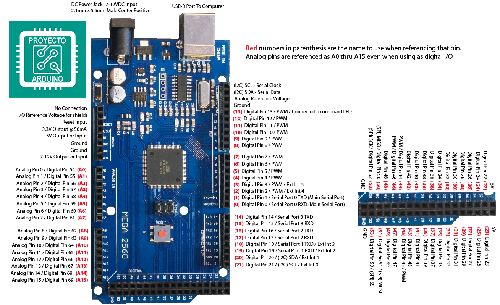

# treadmill
This repository contains code to control a motorised treadmill while acquiring its speed readout and video data from two cameras.

The structure and detailed content of the repository is described below.

(coming soon)

The setup uses an ArduinoMega2560 pictured below:

